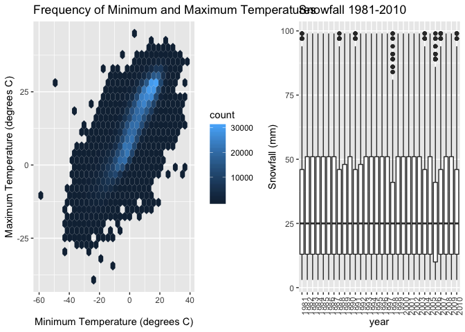

Homework 3: Amelia Grant-Alfieri, ag3911
================

# Problem 1

## Read and clean BRFSS data

  - format to use appropriate variable names
  - focus on “overall health” topic
  - include only responses from “excellent” to “poor”
  - organize responses as factor levels from “excellent” to “poor”

<!-- end list -->

``` r
#install.packages("devtools", force = TRUE)
devtools::install_github("p8105/p8105.datasets")

library(p8105.datasets)
library(tidyverse)
brfss <- brfss_smart2010 %>%
  janitor::clean_names() %>%
  select(year, locationdesc, topic, response, data_value) %>%
  filter(topic == "Overall Health") %>% 
  select(-topic) %>%
  rename("Overall Health Response" = response) %>%
  rename("Overall Health Value" = data_value) %>%
  separate(locationdesc, into = c("state", "county"), sep = " - ") %>% 
  mutate(`Overall Health Response` = as.factor(`Overall Health Response`)) 
```

## Q1: In 2002, which states were observed at 7 locations?

``` r
brfss %>%
  filter(year == '2002') %>%
  group_by(state) %>%
  summarize(n = n_distinct(county)) %>%
  filter(n == 7)
```

    ## # A tibble: 3 x 2
    ##   state     n
    ##   <chr> <int>
    ## 1 CT        7
    ## 2 FL        7
    ## 3 NC        7

In 2002, Connecticut, Florida, and North Carolina were observed at 7
county
locations.

## Q2: Make a “spaghetti plot” that shows the number of observations in each state from 2002 to 2010.

``` r
library(ggplot2)
library(patchwork)

brfss_plot = brfss %>%
  distinct(year, state, county) %>%      #to keep only unique/distinct rows 
  group_by(year, state) %>%
  summarize(number = n())
ggplot(data = brfss_plot, aes(x = year, y = number, color = state))+ geom_line() + labs(title = "Observations by State, 2002-2010")
```

<!-- -->

## Q3: Make a table showing, for the years 2002, 2006, and 2010, the mean and standard deviation of the proportion of “Excellent” responses across locations in NY State.

``` r
brfss_02_06_10 = brfss %>%
  filter(year == '2002' | year == '2006' | year == '2010') %>%
  filter(state == "NY") %>%
  spread(key = "Overall Health Response", value = "Overall Health Value") %>% 
  select(year, county, Excellent) %>% 
  group_by(year) %>%
  summarize(mean_ex = mean(Excellent), 
            sd_ex = sd(Excellent))
brfss_02_06_10
```

    ## # A tibble: 3 x 3
    ##    year mean_ex sd_ex
    ##   <int>   <dbl> <dbl>
    ## 1  2002    24.0  4.49
    ## 2  2006    22.5  4.00
    ## 3  2010    22.7  3.57

## Q4: For each year and state, compute the average proportion in each response category (taking the average across locations in a state).

``` r
brfss_avg = brfss %>%
  spread(key = "Overall Health Response", value = "Overall Health Value") %>% 
  group_by(year, state) %>%
  summarize(mean_excellent = mean(Excellent), 
            mean_vgood = mean(`Very good`),
            mean_good = mean(Good),
            mean_fair = mean(Fair),
            mean_poor = mean(Poor))
brfss_avg
```

    ## # A tibble: 443 x 7
    ## # Groups:   year [?]
    ##     year state mean_excellent mean_vgood mean_good mean_fair mean_poor
    ##    <int> <chr>          <dbl>      <dbl>     <dbl>     <dbl>     <dbl>
    ##  1  2002 AK              27.9       33.7      23.8      8.6       5.9 
    ##  2  2002 AL              18.5       30.9      32.7     12.1       5.9 
    ##  3  2002 AR              24.1       29.3      29.9     12.5       4.2 
    ##  4  2002 AZ              24.1       33.4      29.4      8.9       4.25
    ##  5  2002 CA              22.7       29.8      28.7     14.3       4.5 
    ##  6  2002 CO              23.1       32.5      30.3     11.2       2.92
    ##  7  2002 CT              29.1       33.8      25.0      8.73      3.43
    ##  8  2002 DC              29.3       31.8      28.1      8.3       2.4 
    ##  9  2002 DE              20.9       34.2      29.8     11.1       4   
    ## 10  2002 FL              25.7       31.1      28.9      9.67      4.53
    ## # ... with 433 more rows

## Q5: Make a five-panel plot that shows, for each response category separately, the distribution of these state-level averages over time.

``` r
brfss %>%
  #select(year, state, `Overall Health Response`) %>% 
  mutate(year = as.factor(year)) %>%
  group_by(year, state, `Overall Health Response`) %>%
  summarize(mean = mean(`Overall Health Value`)) %>%
  ggplot(aes(x = year, y = mean)) +
  geom_boxplot() + 
  facet_grid(~`Overall Health Response`) + theme(axis.text.x = element_text(angle = 90)) + labs(title = "State-level Mean Proportion of Responses Over Time") 
```

    ## Warning: Removed 21 rows containing non-finite values (stat_boxplot).

<!-- -->

# Problem 2

## Read and clean Instacart data

``` r
#install.packages("devtools", force = TRUE)
devtools::install_github("p8105/p8105.datasets")
```

    ## Skipping install of 'p8105.datasets' from a github remote, the SHA1 (21f5ad1c) has not changed since last install.
    ##   Use `force = TRUE` to force installation

``` r
library(p8105.datasets)
library(tidyverse)

instacart = instacart %>%
  janitor::clean_names() 
```

The size of the dataset is 1384617, 15. It contains information about
orders, products ordered, and customers. Order information includes the
order ID number, the order in which each product was added to the online
shopping cart, whether or not reordering in the cart occurred, the day
of the week and hour of the day it was placed. For example, an order
placed on day of the week 5 at hour 17 means that it was placed on
Friday at 5 pm. Product information includes the product ID number,
product name, the name of the aisle in which it is found, and the ID
number for and name of the department in which it is found. For example,
the dairy eggs department has ID number 16. Customer information
includes the customer ID number, their order sequence number, and the
number of days since their last
order.

## Q1: How many aisles are there, and which aisles are the most items ordered from?

``` r
instacart %>%
    group_by(aisle_id) %>%
    summarise(n = n())
```

    ## # A tibble: 134 x 2
    ##    aisle_id     n
    ##       <int> <int>
    ##  1        1  2936
    ##  2        2  3873
    ##  3        3 17449
    ##  4        4  9917
    ##  5        5  2905
    ##  6        6  1795
    ##  7        7  1526
    ##  8        8  1501
    ##  9        9  9736
    ## 10       10   448
    ## # ... with 124 more rows

``` r
#to double check, use the code below to count aisles using name instead of id. should get the same number of aisles
#instacart %>%      
    #group_by(aisle) %>%
    #summarize(n = n())
```

There are 134 aisles.

``` r
#to find from which aisles the most items are ordered
cart = instacart %>%
    group_by(aisle) %>%
    summarize(n = n()) %>%
    filter(min_rank(desc(n)) < 4)
cart
```

    ## # A tibble: 3 x 2
    ##   aisle                           n
    ##   <chr>                       <int>
    ## 1 fresh fruits               150473
    ## 2 fresh vegetables           150609
    ## 3 packaged vegetables fruits  78493

The most items are ordered from 1) the “fresh vegetables” aisle followed
by 2) the “fresh fruits” aisle followed by 3) the “packaged vegetables
fruits”
aisle.

## Q2: Make a plot that shows the number of items ordered in each aisle. Order aisles sensibly, and organize your plot so others can read it.

``` r
instacart %>%
  group_by(aisle) %>%
  summarize(number = n()) %>%
  ggplot(aes(x = reorder(aisle, -number), y = number)) + geom_point() + theme(axis.text.x = element_text(angle = 90, size = 5)) + labs(title = "Number of Items Ordered in Each Aisle") + labs(x = "Aisle Name", y = "Number of Items")
```

<!-- -->

## Q3: Make a table showing the most popular item in aisles “baking ingredients”, in “dog food care”, and in “packaged vegetables fruits”

``` r
cart_bake_dog_vegf = instacart %>%
  filter(aisle == 'baking ingredients' | aisle == 'dog food care' | aisle == 'packaged vegetables fruits') %>%
  select(product_name, aisle) %>% 
  group_by(aisle, product_name) %>%
  summarise(n = n()) %>%
  arrange(desc(n)) #to sort from highest to lowest the #(n) of each product within aisles
cart_bake_dog_vegf
```

    ## # A tibble: 1,444 x 3
    ## # Groups:   aisle [3]
    ##    aisle                      product_name                          n
    ##    <chr>                      <chr>                             <int>
    ##  1 packaged vegetables fruits Organic Baby Spinach               9784
    ##  2 packaged vegetables fruits Organic Raspberries                5546
    ##  3 packaged vegetables fruits Organic Blueberries                4966
    ##  4 packaged vegetables fruits Seedless Red Grapes                4059
    ##  5 packaged vegetables fruits Organic Grape Tomatoes             3823
    ##  6 packaged vegetables fruits Organic Baby Carrots               3597
    ##  7 packaged vegetables fruits Organic Baby Arugula               2923
    ##  8 packaged vegetables fruits Organic Peeled Whole Baby Carrots  2460
    ##  9 packaged vegetables fruits Red Raspberries                    1493
    ## 10 packaged vegetables fruits Clementines, Bag                   1478
    ## # ... with 1,434 more rows

``` r
#to collapse repeat aisles and only show the top 1
top = cart_bake_dog_vegf %>%
    group_by(aisle) %>%
    top_n(1)
```

    ## Selecting by n

``` r
top 
```

    ## # A tibble: 3 x 3
    ## # Groups:   aisle [3]
    ##   aisle                    product_name                                  n
    ##   <chr>                    <chr>                                     <int>
    ## 1 packaged vegetables fru… Organic Baby Spinach                       9784
    ## 2 baking ingredients       Light Brown Sugar                           499
    ## 3 dog food care            Snack Sticks Chicken & Rice Recipe Dog T…    30

## Q4: Make a table showing the mean hour of the day at which Pink Lady Apples and Coffee Ice Cream are ordered on each day of the week; format this table for human readers (i.e. produce a 2 x 7 table).

``` r
apple_icecream = instacart %>%
  filter(product_name == 'Pink Lady Apples' | product_name == 'Coffee Ice Cream') %>%
  mutate(order_dow = as.character(order_dow)) %>%
  mutate(order_dow = recode(order_dow, `0` = "0:Sunday", `1` = "1:Monday", `2` = "2:Tuesday", `3` ="3:Wednesday", `4` = "4:Thursday", `5` = "5:Friday", `6` = "6:Saturday")) %>%
  group_by(order_dow, product_name) %>%
  #recode(order_dow, `0` = "Sunday", 1 = "Monday", 2 = "Tuesday", 3 ="Wednesday", 4 = "Thursday", 5 = "Friday", 6 = "Saturday") %>% 
  summarise(mean_hr = mean(order_hour_of_day)) %>%
  spread(key = order_dow, value = mean_hr) %>%
  knitr::kable(digits = 1)
apple_icecream
```

| product\_name    | 0:Sunday | 1:Monday | 2:Tuesday | 3:Wednesday | 4:Thursday | 5:Friday | 6:Saturday |
| :--------------- | -------: | -------: | --------: | ----------: | ---------: | -------: | ---------: |
| Coffee Ice Cream |     13.8 |     14.3 |      15.4 |        15.3 |       15.2 |     12.3 |       13.8 |
| Pink Lady Apples |     13.4 |     11.4 |      11.7 |        14.2 |       11.6 |     12.8 |       11.9 |

# Problem 3

## Read and Clean New York NOAA data

*Create separate variables for year, month, and day. *Ensure
observations for temperature, precipitation, and snowfall are given in
reasonable units. \*For snowfall, what are the most commonly observed
values? Why?

``` r
#install.packages("devtools", force = TRUE)
devtools::install_github("p8105/p8105.datasets")
```

    ## Skipping install of 'p8105.datasets' from a github remote, the SHA1 (21f5ad1c) has not changed since last install.
    ##   Use `force = TRUE` to force installation

``` r
library(p8105.datasets)
library(tidyverse)

clean_ny_noaa = ny_noaa %>%
  janitor::clean_names() %>%
  na.omit() %>%
  separate(date, into = c("year", "month", "day"), sep = "-") %>%
  mutate(tmin = as.numeric(tmin)) %>%
  mutate(tmax = as.numeric(tmax)) %>%
  mutate(tmax = tmax/10) %>%    # to convert max temp unit from a tenth of a degree to a degree
  mutate(tmin = tmin/10)        # to convert min temp unit from a tenth of a degree to a degree

snow = clean_ny_noaa %>%
  group_by(snow) %>%  
  summarise(n = n()) %>%
  top_n(1)              #the most commonly observed value is 0 (mm of snow). 
```

    ## Selecting by n

``` r
snow
```

    ## # A tibble: 1 x 2
    ##    snow       n
    ##   <int>   <int>
    ## 1     0 1112758

The New York NOAA dataset contains weather station ID, date of
observation, and observations of precipitation, snowfall, snow depth,
maximum temperature, and minimum temperature. Its dimensions are
2595176, 7. There is a lot of missing data, especially for temperature.
For snowfall, the most commonly observed value is zero because for the
majority of the year the conditions are not right for
snow.

## Q1: Make a two-panel plot showing the average max temperature in January and in July in each station across years. Is there any observable / interpretable structure? Any outliers?

``` r
#to clean the dataset according to the specifications of Q1
jan_july = clean_ny_noaa %>%
    select(year, month, id, tmin, tmax) %>%
    filter(month == '01' | month == '07') %>%
    mutate(year = as.factor(year)) %>%
    group_by(year, month, id) %>% 
    summarize(month_mean = mean(tmax)) %>%
    ggplot(aes(x = year, y = month_mean)) + geom_boxplot() + facet_grid(.~ month) + theme(axis.text.x = element_text(angle = 90)) + labs(title = "Maximum Temperatures in January and July 1981-2010", y = "Average Maximum Temperature per Month (degrees Celsius)")
jan_july
```

<!-- -->
The average maximum temperatures are consistently higher across years in
July than in January, which would be expected. For January, the median
average maximum temperature per year ranges from 5 to -5 C and there are
two significant outliers: -17 C in 1982 and -16 C in 1996. For July, the
median average maximum temperature per year ranges from 24 to 29 C and
there is one significant outlier, 15 C in 1988.

## Q2: Make a two-panel plot with two plots.

### Plot 1: tmax vs tmin for the full dataset.

``` r
library(ggplot2)
library(hexbin)
min_max_plot = clean_ny_noaa %>%
    select(tmin, tmax) %>%
    ggplot(aes(x = tmin, y = tmax)) + geom_hex() + labs(title = "Frequency of Minimum and Maximum Temperatures", x = "Minimum Temperature (degrees C)", y = "Maximum Temperature (degrees C)") 
min_max_plot
```

<!-- -->

### Plot 2: The distribution of snowfall values greater than 0 and less than 100 separately by year.

``` r
snow_plot = clean_ny_noaa %>%
    select(year, snow) %>%
    filter(snow < 100, snow > 0) %>%
    ggplot(aes(x = year, y = snow)) + geom_boxplot() + theme(axis.text.x = element_text(angle = 90)) + labs(title = "Snowfall 1981-2010", y = "Snowfall (mm)")
snow_plot
```

<!-- -->

### Plot 1 + Plot 2

``` r
#stitch the two plots together 
library(patchwork)
min_max_plot + snow_plot
```

<!-- -->
